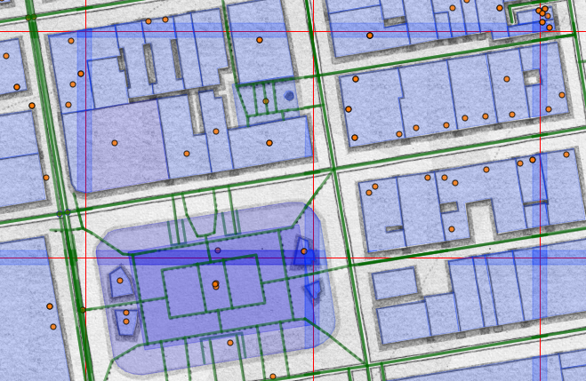

# investigate-raw-tile-data

node >=6.x needed

```
git clone git@github.com:BergWerkGIS/investigate-raw-tile-data.git
cd investigate-raw-tile-data.git
npm install
Windows: SET MAPBOX_ACCESS_TOKEN=<YOUR_TOKEN>
Linux/OSX: export MAPBOX_ACCESS_TOKEN=<YOUR_TOKEN>
node index
```

Open browser at http://localhost:666/show-tiles.html


